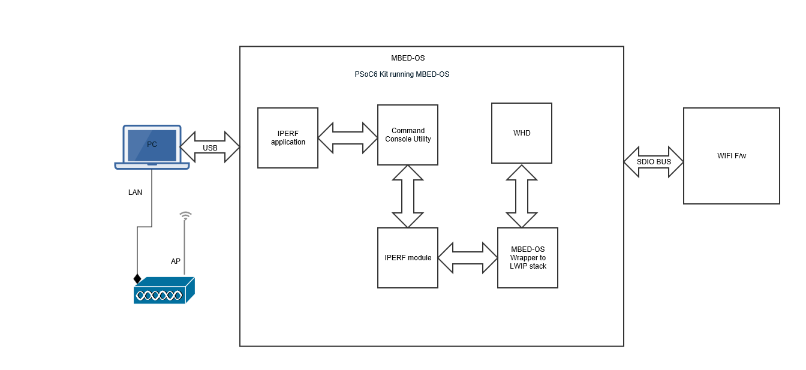

# Mbed OS Tester - Wi-Fi Bluetooth&reg; Console

This application integrates the command console library including Wi-Fi iPerf and Bluetooth® LE functionality. Using this application, you can characterize the Wi-Fi/Bluetooth® LE functionality and performance.

This application supports the measurement of the Wi-Fi throughput across both STA mode and SoftAP mode.

- **In STA mode** (via the compile flag `STA_INTERFACE`), the application establishes a Wi-Fi connection to the AP. It uses the Command Console framework to start a TCP client, TCP server, UDP client, or UDP server.

- **In SoftAP mode** (via the compile flag `AP_INTERFACE`), the iPerf application requires a remote PC to establish a Wi-Fi connection to the Soft AP. It uses the Command Console framework to start a TCP client, TCP server, UDP client, or UDP server.

See the command console library [Readme.md](https://github.com/cypresssemiconductorco/command-console/blob/master/README.md) for more information.

## Requirements

- [Mbed OS toolchain](https://github.com/ARMmbed/mbed-cli-windows-installer/releases/tag/v0.4.10)

- Programming language: C

- Associated parts: All [PSoC&trade; 6 MCU](http://www.cypress.com/PSoC6) parts

- [Tera Term](https://tera-term.en.lo4d.com/windows)


## Supported toolchains (Mbed CLI argument -t)

- GNU Arm® embedded compiler v9.3.1 (GCC_ARM)

- Arm compiler v6.14 (ARM)

## Supported kits (Mbed CLI argument -m)

- [PSoC&trade; 6 Wi-Fi Bluetooth® prototyping kit (CY8CPROTO-062-4343W)](https://www.cypress.com/CY8CPROTO-062-4343W)

- [PSoC&trade; 62S2 Wi-Fi Bluetooth® pioneer kit (CY8CKIT-062S2-43012)](https://www.cypress.com/CY8CKIT-062S2-43012)

## Hardware setup

This application uses the board's default configuration. See the kit user guide to ensure that the board is configured correctly.

The application running on a PSoC&trade; 6 MCU kit and the test setup are shown below:



To test Bluetooth® LE commands, use a peer CYW920719B2Q40EVB-01 device running the LE CoC application.


## Software setup

Install a terminal emulator if you don't have one. Instructions in this document use [Tera Term](https://ttssh2.osdn.jp/index.html.en)

### Set up iPerf on the host

1. Download and install [iPerf 2.0.13](https://sourceforge.net/projects/iperf2/files/) (supported on Ubuntu, macOS, and Windows).

2. Go to the iPerf installation directory and launch the terminal (command prompt for Windows, terminal shell for macOS or Ubuntu).

### Setup the LE CoC application on the CYW920719B2Q40EVB-01 peer device

1. On the ModusToolbox&trade; Project creator, select the CYW920719B2Q40EVB-01 device and create a LE connection-oriented channel (CoC) application.

2. Build the [le_coc](https://github.com/cypresssemiconductorco/mtb-examples-CYW920719B2Q40EVB-01-btsdk-ble/tree/master/ble/le_coc) application to run LE connection-oriented channel (CoC) on the peer device. This is part of the ModusToolbox&trade; BTSDK.

See [Building the code examples](https://github.com/cypresssemiconductorco/mtb-examples-CYW920719B2Q40EVB-01-btsdk-ble#building-code-examples) for build and installation instructions.

**Note:** Ensure that the LE CoC application is configured to run without pairing enabled, using the client control setting.

## Using the _Mbed OS Tester - Wi-Fi Bluetooth® Console_

1. Download and unzip this repository onto your local machine, or clone the repository.

2. Open a CLI terminal and navigate to the application folder.

3. Prepare the cloned working directory for Mbed OS:
   ```
   mbed config root .
   ```

4. Import the required libraries by executing the `mbed deploy -v` command.


## Operation

1. Connect the board to your PC using the provided USB cable through the KitProg3 USB connector.

2. Modify `default-wifi-ssid` and `default-wifi-password` of the `target overrides` section of *mbed_app.json*:

   ```
	"target_overrides": {
       "*": {
	       ...
           "nsapi.default-wifi-ssid": "\"SSID\"",
           "nsapi.default-wifi-password": "\"PASSWORD\"",
		   ...
       }
   }
   ```

3. Configure the TCP window size in iPerf before building the application. See the command console library [Readme.md](https://github.com/cypresssemiconductorco/command-console/blob/master/README.md) for instructions on how to configure the TCP window size.

4. Save *mbed_app.json*.

5. Put the board in DAPLink mode by pressing the SW3 button on the kit. When done, the board will appear as a mass storage drive on your Windows PC.

6. Program the board.

   From the terminal, execute the `mbed compile` command to build and program the application using the default toolchain to the default target. You can specify a target and toolchain manually:
   ```
   mbed compile -m `kit` -t `toolchain` -f
   ```

   Example:
   ```
   mbed compile -m CY8CKIT_062S2_43012 -t GCC_ARM -f
   ```

   After programming, the application starts automatically. Observe the messages on the UART terminal, and wait for the device to make the required connections.

7. The application connects to the configured Wi-Fi access point and obtains the IP address. When the device is ready, the `>` prompt appears.

8. Run iPerf commands (client and server) against a remote peer device.

   See [Running iPerf client and server against a remote peer device](https://github.com/cypresssemiconductorco/command-console#iperf-command).

9. Run Bluetooth® LE commands against a remote peer device.

   A remote peer device can be the LE CoC application on a CYW20719B2Q40EVB-01 kit.

   See [Running Bluetooth® LE commands against a remote peer device](https://github.com/cypresssemiconductorco/command-console#ble-commands).

## Debugging

You can debug the example to step through the code. In the IDE, use the **\<Application Name> Debug (KitProg3_MiniProg4)** configuration in the **Quick Panel**. For more details, see the "Program and debug" section in the [Eclipse IDE for ModusToolbox&trade; user guide](https://www.cypress.com/MTBEclipseIDEUserGuide).

Follow the steps from [Eclipse IDE for ModusToolbox&trade; user guide](https://www.cypress.com/MTBEclipseIDEUserGuide#page=23) to export the Mbed OS code example and import it into Eclipse IDE for ModusToolbox&trade; for programming and debugging.

Mbed OS also supports debugging using any IDE that supports GDB. See [Arm&reg; Mbed documentation](https://os.mbed.com/docs/mbed-os/v6.2/debug-test/index.html) to learn about debugging steps.

### Notes on debugging

- On the CM4 CPU, some code in `main()` may execute before the debugger halts at the beginning of `main()`. This means that some code executes twice - once before the debugger stops execution, and again after the debugger resets the program counter to the beginning of `main()`. See [KBA231071](https://community.cypress.com/docs/DOC-21143) to learn about this and for the workaround.

- While running iPerf tests, if you encounter buffer-related errors (*failed to allocate a buffer ...*, for example), tune the following configurations in *mbed_app.json* to a lower value and run the tests again. See the following as an example:

   ```
	"target_overrides": {
       "*": {
           ...
           "lwip.memp-num-tcp-seg": 48
           "lwip.memp-num-tcpip-msg-inpkt": 48,
           "lwip.mbox-size": 16
           "lwip.pbuf-pool-size" : 60,
           "lwip.tcp-snd-buf": "(10* TCP_MSS)",
           "lwip.tcp-wnd": "(TCP_MSS * 10),
           ...
       }
   }
   ```

## Design and implementation

This application integrates the command console library including Wi-Fi iPerf and Bluetooth® LE functionality. The command console library is initialized which allows you to test the Wi-Fi, Bluetooth®, and iPerf commands through command line.

### Resources and settings

| Resource  |  Alias/object     |    Purpose     |
| :------- | :------------    | :------------ |
| UART (HAL)|cy_retarget_io_uart_obj| UART HAL object used by Retarget-IO for the Debug UART port  |

## Related resources

| Application notes                                            |                                                              |
| :----------------------------------------------------------- | :----------------------------------------------------------- |
| [AN228571](https://www.cypress.com/AN228571) – Getting started with PSoC&trade; 6 MCU on ModusToolbox&trade; | Describes PSoC&trade; 6 MCU devices and how to build your first application with ModusToolbox&trade; |
| [AN221774](https://www.cypress.com/AN221774) – Getting started with PSoC&trade; 6 MCU on PSoC&trade; Creator&trade; | Describes PSoC&trade; 6 MCU devices and how to build your first application with PSoC&trade; Creator&trade; |
| [AN210781](https://www.cypress.com/AN210781) – Getting started with PSoC&trade; 6 MCU with Bluetooth® Low Energy connectivity on PSoC&trade; Creator&trade; | Describes PSoC&trade; 6 MCU with Bluetooth® LE connectivity devices and how to build your first application with PSoC&trade; Creator&trade; |
| [AN215656](https://www.cypress.com/AN215656) – PSoC&trade; 6 MCU: dual-CPU system design | Describes the dual-CPU architecture in PSoC&trade; 6 MCU, and shows how to build a simple dual-CPU design |
| **Code examples**                                            |                                                              |
| [Using ModusToolbox&trade;](https://github.com/cypresssemiconductorco/Code-Examples-for-ModusToolbox-Software) | [Using PSoC&trade; Creator&trade;](https://www.cypress.com/documentation/code-examples/psoc-6-mcu-code-examples) |
| **Device documentation**                                     |                                                              |
| [PSoC&trade; 6 MCU datasheets](https://www.cypress.com/search/all?f[0]=meta_type%3Atechnical_documents&f[1]=resource_meta_type%3A575&f[2]=field_related_products%3A114026) | [PSoC&trade; 6 technical reference manuals](https://www.cypress.com/search/all/PSoC%206%20Technical%20Reference%20Manual?f[0]=meta_type%3Atechnical_documents&f[1]=resource_meta_type%3A583) |
| **Development kits**                                         | Buy at www.cypress.com                                       |
| [CY8CPROTO-062-4343W](https://www.cypress.com/CY8CPROTO-062-4343W) PSoC&trade; 6 Wi-Fi Bluetooth® prototyping kit | [CY8CKIT-062S2-43012](https://www.cypress.com/CY8CKIT-062S2-43012) PSoC&trade; 62S2 Wi-Fi Bluetooth® pioneer kit |
| **Libraries**                                                |                                                              |
| PSoC&trade; 6 peripheral driver library (PDL) and docs  | [mtb-pdl-cat1](https://github.com/cypresssemiconductorco/mtb-pdl-cat1) on GitHub |
| Hardware abstraction layer (HAL) Library and docs    | [mtb-hal-cat1](https://github.com/cypresssemiconductorco/mtb-hal-cat1) on GitHub |
| Retarget-IO - A utility library to retarget the standard input/output (STDIO) messages to a UART port | [retarget-io](https://github.com/cypresssemiconductorco/retarget-io) on GitHub |
| **Middleware**
| connectivity-utilities lbrary                               | [connectivity-utilities library](https://github.com/cypresssemiconductorco/connectivity-utilities) on GitHub |
| Links to all PSoC&trade; 6 MCU middleware                           | [psoc6-middleware](https://github.com/cypresssemiconductorco/psoc6-middleware) on GitHub |
| **Tools**                                                    |                                                              |
| [Eclipse IDE for ModusToolbox&trade;](https://www.cypress.com/modustoolbox) | The cross-platform, Eclipse-based IDE for IoT designers that supports application configuration and development targeting converged MCU and wireless systems. |
| [PSoC&trade; Creator™](https://www.cypress.com/products/psoc-creator-integrated-design-environment-ide) | The Cypress IDE for PSoC&trade; and FM0+ MCU development. |

## Other resources

- [Command console library](https://github.com/cypresssemiconductorco/command-console)

- [connectivity-utilities library](https://github.com/cypresssemiconductorco/connectivity-utilities)

- [Arm mbed-os 6.2.0](https://os.mbed.com/mbed-os/releases)

Cypress provides a wealth of data at www.cypress.com to help you select the right device, and quickly and effectively integrate it into your design.

For PSoC&trade; 6 MCU devices, see [How to design with PSoC&trade; 6 MCU - KBA223067](https://community.cypress.com/docs/DOC-14644) in the Cypress community.

## Document history

Document title: Mbed OS Tester - Wi-Fi Bluetooth&reg; Console

| Version | Description of Change |
| ------- | --------------------- |
| 1.0.0   | New code example      |
| 1.1.0   | Updated the app to use the latest connectivity utilities and command console library. |
| 1.2.0   | Updated the app to use the latest connectivity utilities and command console library. |
| 1.3.0   | Updated the app to use the latest connectivity utilities and command console library. |

------

© Cypress Semiconductor Corporation, 2020-2021. This document is the property of Cypress Semiconductor Corporation, an Infineon Technologies company, and its affiliates ("Cypress").  This document, including any software or firmware included or referenced in this document ("Software"), is owned by Cypress under the intellectual property laws and treaties of the United States and other countries worldwide.  Cypress reserves all rights under such laws and treaties and does not, except as specifically stated in this paragraph, grant any license under its patents, copyrights, trademarks, or other intellectual property rights.  If the Software is not accompanied by a license agreement and you do not otherwise have a written agreement with Cypress governing the use of the Software, then Cypress hereby grants you a personal, non-exclusive, nontransferable license (without the right to sublicense) (1) under its copyright rights in the Software (a) for Software provided in source code form, to modify and reproduce the Software solely for use with Cypress hardware products, only internally within your organization, and (b) to distribute the Software in binary code form externally to end users (either directly or indirectly through resellers and distributors), solely for use on Cypress hardware product units, and (2) under those claims of Cypress’s patents that are infringed by the Software (as provided by Cypress, unmodified) to make, use, distribute, and import the Software solely for use with Cypress hardware products.  Any other use, reproduction, modification, translation, or compilation of the Software is prohibited.
<br>
TO THE EXTENT PERMITTED BY APPLICABLE LAW, CYPRESS MAKES NO WARRANTY OF ANY KIND, EXPRESS OR IMPLIED, WITH REGARD TO THIS DOCUMENT OR ANY SOFTWARE OR ACCOMPANYING HARDWARE, INCLUDING, BUT NOT LIMITED TO, THE IMPLIED WARRANTIES OF MERCHANTABILITY AND FITNESS FOR A PARTICULAR PURPOSE.  No computing device can be absolutely secure.  Therefore, despite security measures implemented in Cypress hardware or software products, Cypress shall have no liability arising out of any security breach, such as unauthorized access to or use of a Cypress product.  CYPRESS DOES NOT REPRESENT, WARRANT, OR GUARANTEE THAT CYPRESS PRODUCTS, OR SYSTEMS CREATED USING CYPRESS PRODUCTS, WILL BE FREE FROM CORRUPTION, ATTACK, VIRUSES, INTERFERENCE, HACKING, DATA LOSS OR THEFT, OR OTHER SECURITY INTRUSION (collectively, "Security Breach").  Cypress disclaims any liability relating to any Security Breach, and you shall and hereby do release Cypress from any claim, damage, or other liability arising from any Security Breach.  In addition, the products described in these materials may contain design defects or errors known as errata which may cause the product to deviate from published specifications.  To the extent permitted by applicable law, Cypress reserves the right to make changes to this document without further notice. Cypress does not assume any liability arising out of the application or use of any product or circuit described in this document.  Any information provided in this document, including any sample design information or programming code, is provided only for reference purposes.  It is the responsibility of the user of this document to properly design, program, and test the functionality and safety of any application made of this information and any resulting product.  "High-Risk Device" means any device or system whose failure could cause personal injury, death, or property damage.  Examples of High-Risk Devices are weapons, nuclear installations, surgical implants, and other medical devices.  "Critical Component" means any component of a High-Risk Device whose failure to perform can be reasonably expected to cause, directly or indirectly, the failure of the High-Risk Device, or to affect its safety or effectiveness.  Cypress is not liable, in whole or in part, and you shall and hereby do release Cypress from any claim, damage, or other liability arising from any use of a Cypress product as a Critical Component in a High-Risk Device.  You shall indemnify and hold Cypress, including its affiliates, and its directors, officers, employees, agents, distributors, and assigns harmless from and against all claims, costs, damages, and expenses, arising out of any claim, including claims for product liability, personal injury or death, or property damage arising from any use of a Cypress product as a Critical Component in a High-Risk Device.  Cypress products are not intended or authorized for use as a Critical Component in any High-Risk Device except to the limited extent that (i) Cypress’s published data sheet for the product explicitly states Cypress has qualified the product for use in a specific High-Risk Device, or (ii) Cypress has given you advance written authorization to use the product as a Critical Component in the specific High-Risk Device and you have signed a separate indemnification agreement.
<br>
Cypress, the Cypress logo, and combinations thereof, WICED, ModusToolBox, PSoC, CapSense, EZ-USB, F-RAM, and Traveo are trademarks or registered trademarks of Cypress or a subsidiary of Cypress in the United States or in other countries.  For a more complete list of Cypress trademarks, visit cypress.com.  Other names and brands may be claimed as property of their respective owners.
