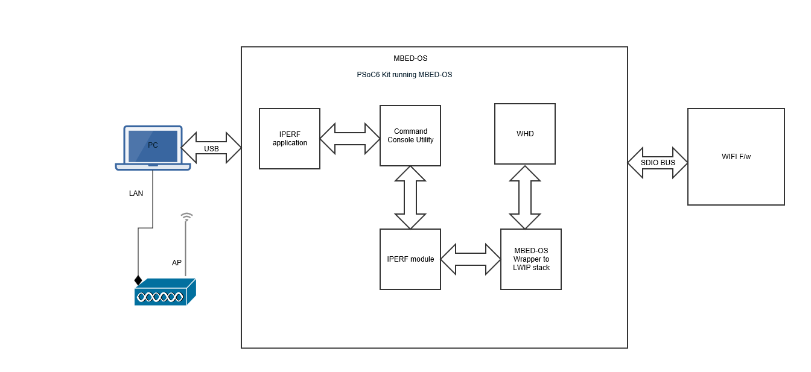

# Mbed OS Wi-Fi Bluetooth Tester
This application integrates the command console library including Wi-Fi iPerf and Bluetooth LE functionality. Using this application, you can characterize the Wi-Fi/BLE functionality and performance.

This application supports measurement of the Wi-Fi throughput across both STA mode and SoftAP mode.

- In STA mode (via the compile flag `STA_INTERFACE`), the application establishes a Wi-Fi connection to the AP. It uses the command console framework to start a TCP client, TCP server, UDP client, or UDP server.

- In SoftAP mode (via the compile flag `AP_INTERFACE`), the iPerf application requires a remote PC to establish a Wi-Fi connection to the Soft AP. It uses the command console framework to start a TCP client, TCP server, UDP client, or UDP server.

## Requirements

- [Mbed OS toolchain](https://github.com/ARMmbed/mbed-cli-windows-installer/releases/tag/v0.4.10)
- Programming Language: C
- Associated Parts: All [PSoC® 6 MCU](http://www.cypress.com/PSoC6) parts
- Supported Toolchains: Arm® GCC, ARM Compiler 6
- [Tera Term](https://tera-term.en.lo4d.com/windows)

## Dependent assets
- [Command Console Library](https://github.com/cypresssemiconductorco/command-console)

- [connectivity-utilities Library](https://github.com/cypresssemiconductorco/connectivity-utilities)

- [ARM mbed-os stack version 6.2.0 and above](https://os.mbed.com/mbed-os/releases)

## Supported Kits
- [PSoC 6 Wi-Fi BT Prototyping Kit](https://www.cypress.com/CY8CPROTO-062-4343W) (CY8CPROTO-062-4343W)

- [PSoC 62S2 Wi-Fi BT Pioneer Kit](https://www.cypress.com/CY8CKIT-062S2-43012) (CY8CKIT-062S2-43012)

## Hardware Setup
This application uses the board's default configuration. See the kit user guide to ensure that the board is configured correctly.

The application running on a PSoC 6 MCU kit and the test setup are shown below:



To test BLE commands a peer device CYW920719B2Q40EVB-01 running LE COC application should be used.


## Software Setup
1. Install a terminal emulator if you don't have one. Instructions in this document use [Tera Term](https://ttssh2.osdn.jp/index.html.en)

2. Install [iPerf 2.0.13](https://sourceforge.net/projects/iperf2/files/) (Supported on Ubuntu, macOS, and Windows).

## Using the Wi-Fi Bluetooth Tester

### In Command-line Interface (CLI):

1. Download and unzip this repository onto your local machine, or clone the repository.

2. Open a CLI terminal and navigate to the application folder.

3. Prepare the cloned working directory for Mbed OS:
   ```  
   mbed config root .
   ```

4. Import the required libraries by executing the `mbed deploy -v` command.

## Operation

1. Modify `wifi-ssid` and `wifi-password` in *mbed_app.json*:

   ```
    "config": {
        "wifi-ssid": {
            "help": "WiFi SSID",
            "value": "\"SSID\""
        },
        "wifi-password": {
            "help": "WiFi Password",
            "value": "\"PASSWORD\""
        },
        ...
   }
   ```
2. Save *mbed_app.json*.

3. Put the board in DAPLink mode by pressing the SW3 button on the kit. When done, the board will appear as a Mass Storage Drive on your Windows PC.

4. Program the board.

   From the terminal, execute the `mbed compile` command to build and program the application using the default toolchain to the default target. You can specify a target and toolchain manually:
   ```
   mbed compile -m `kit` -t `toolchain` -f
   ```
      
   Example:
   ```
   mbed compile -m CY8CKIT-062S2-43012 -t GCC_ARM -f
   ```

   After programming, the application starts automatically. Observe the messages on the UART terminal, and wait for the device to make all the required connections.

The application will connect to the configured Wi-Fi Access Point and obtain IP address. When the device is ready, `>` prompt will appear.

## Setting up iPerf on the host

1. Install [iPerf 2.0.13](https://sourceforge.net/projects/iperf2/files/) on the host.

2. Go to the iPerf installation directory and launch the terminal (command prompt for Windows, terminal shell for macOS and Ubuntu).

## Setting up LE COC application on CYW920719B2Q40EVB-01 peer device

1. To run LE COC on the peer device you need to build [le_coc](https://github.com/cypresssemiconductorco/mtb-examples-CYW920719B2Q40EVB-01-btsdk-ble/tree/master/ble/le_coc) , that is part of ModusToolbox BTSDK.

2. Refer to [Building code examples](https://github.com/cypresssemiconductorco/mtb-examples-CYW920719B2Q40EVB-01-btsdk-ble#building-code-examples) section for build and installation instructions.

*Note: Ensure that the LE COC application is configured to run without pairing enabled, using the setting in client control.*

### Instructions to run iPerf (client and server) against a remote peer device
See [Running iPerf client and server against a remote peer device](https://github.com/cypresssemiconductorco/command-console#run-iperf-client-and-server-against-a-remote-peer-device)

### Instruction to run BLE commands against a remote peer device CYW20719B2Q40EVB-01
See [Running BLE commands against a remote peer device](https://github.com/cypresssemiconductorco/command-console#run-ble-commands-against-a-remote-peer-device)

## Additional information
- [Command Console library API Reference Guide](https://cypresssemiconductorco.github.io/command-console/api_reference_manual/html/index.html)

- [Mbed OS Wi-Fi Bluetooth Tester Version](./version.txt)
